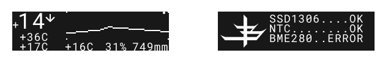
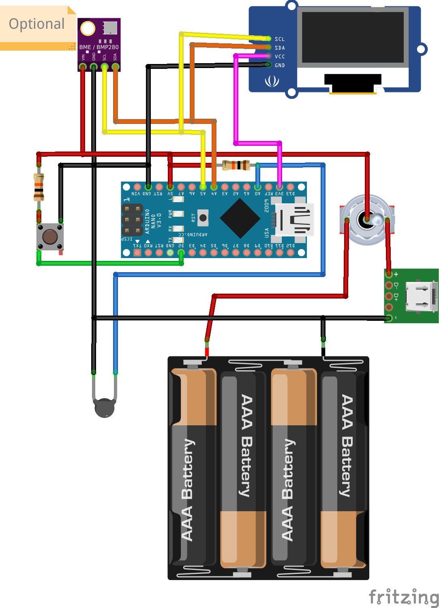
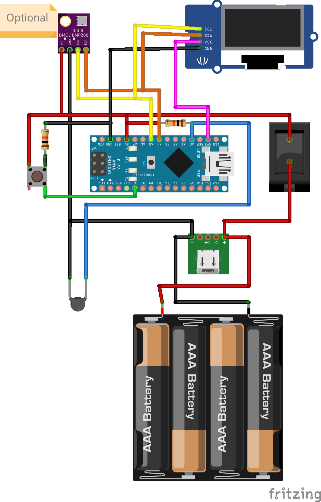

# arduino-thermometer-probe

> Thermometer probe on Arduino

## Display

## Components
- Arduino Nano
- OLED display 128x32 px (0.91") SSD1306 I2C
- NTC Thermistor 10K ohm
- BME280 5V I2C
- Push button
- 2 Resistors 10K ohm
- Switcher
- USB connector
- Battery holder (for 4 AA batteries)

## Scheme

### With BME280

Inspired by:
- https://github.com/AlexGyver/Thermocontrol
- https://alexgyver.ru/thermocontrol/

Additional info:
- [Display libruary](https://learn.adafruit.com/adafruit-gfx-graphics-library/graphics-primitives)
- [Work with buttons](https://alexgyver.ru/lessons/arduino-buttons/)
- [Arduino Language Reference](https://www.arduino.cc/reference/)
